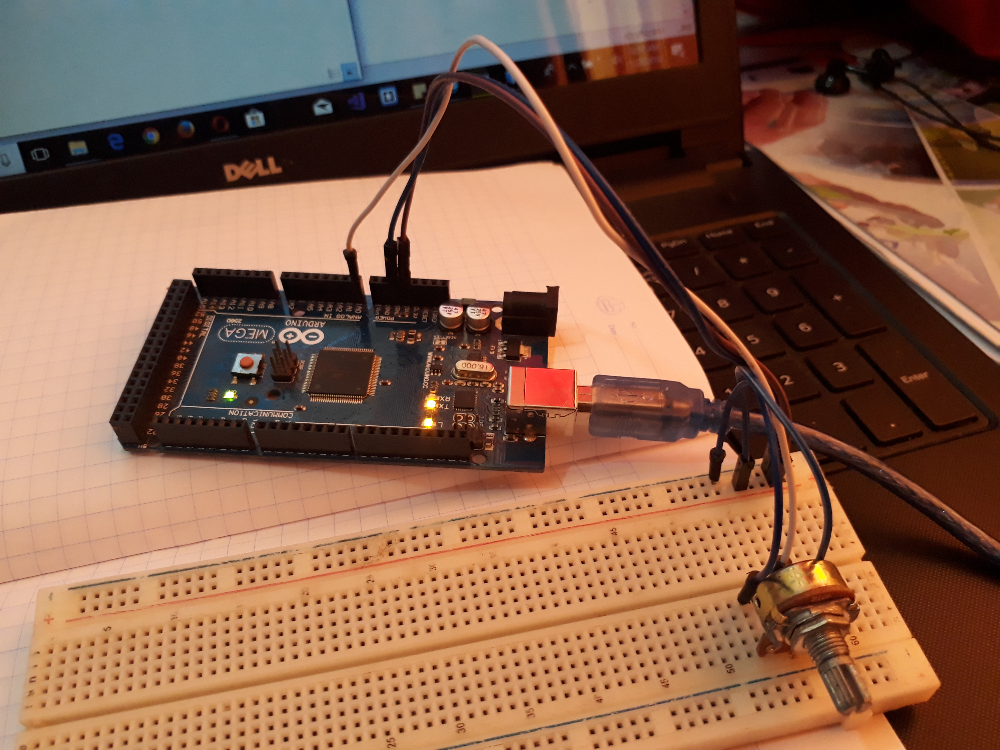

# HirikatuOyaWaterLevel

This is develop to code night min hackethon. It is use to monitor water level of hirikatuoya and inform others if water level increasing. It is basically provide concept of project who solve the problem. Also prepare application to deliver proper idea about project.

## Applications
* Java standard alone applicatoin
* Ardunio project

## Technologies and Application
1. Android IDE
2. Netbeanas

## Images of arduino board configuration

